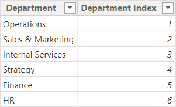
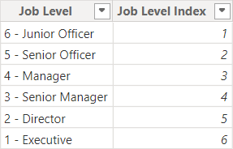
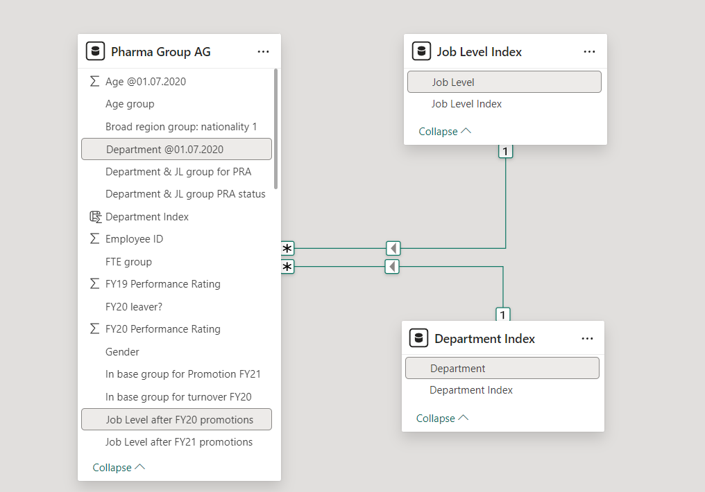

# Diversity Dashboard (PWC Power BI Project Part 3)

## Introduction
This dashboard is final part of a project from the [PwC Power BI micro-internship](https://www.theforage.com/simulations/pwc-ch/power-bi-cqxg) hosted by Forage. Pricewaterhouse Coopers International Limited (PwC) is a multinational professional services brand of firms that specializs in auditing and tax and business consulting.

In this task, the Human Resources department for PhoneNow, a fictional telecom company, has tasked me to construct a dashboard about gender balance. The purpose of creating the dashboard is to help identify issues that may cause gender inbalance at the executive level.

## Problem Statement
PhoneNow's Human Resources dapartment consider diversity and inclusions as business imperatives. The department is working hard to address the gender inbalance at the executive management level but they are seeing no progress in their efforts. The department requests a dashboard that highlights relevant Key Perfromance Indicators which can indicate portential solutions to solving the gender inbalance issue at the executive management level.

## Skills Demonstrated
* Power BI
* Data Visualization
* Dashboard Creation
* Defining KPIs
* Data Transfroming (Excel)
* Data Transforming (Power BI)
* Creating Measures (Power BI)
* Creating Calulated Columns (Power BI)

## Data Sourcing
This data was provided to me by the PwC Power BI microinternship hosted by Forage. A copy of the data is included in this repository under the file name: 03 Diversity-Inclusion-Dataset.xlsx.

## Data Attributes
The data is PhoneNow's customer data. It includes data on customer demographics, payment data, and the type of services they subscribed to. The date ranges from Jan. 1 2021 to Mar. 31 2021.
* Employee ID - A unique number used to identify an employee.
* Gender - The gender of the employee (male or female).
* Job Level after FY20 promotions - The employee's job level after the fiscal year 2020 promotions.
* New hire FY20? - Whether or not the employee is a new hire in fiscal year 2020.
* FY20 Performance Rating - The performance rating for an employee during fiscal year 2020. The higher the rating, the better the performance.
* Promotion in FY21? - Whether or not the employee will be promoted in fiscal year 2021.
* In base group for Promotion FY21 - Whether or not the employee is considered for promotion in fiscal year 2021.
* Target hire balance - The desired gender balance ratio for an employee's position.
* FY20 leaver? - Has the employee left during fiscal year 2020?
* In base group for turnover FY20 - Whether or not the employee is considering leaving in fiscal year 2020.
* Department @01.07.2020 - The employee's department at Jan. 07 2020.
* Leaver FY - The fiscal year that the employee has left.
* Job Level after FY21 promotions - The employee's job level after the fiscal year 2021 promotions.
* Last Department in FY20 - The employee's department at the end of fiscal year 2020.
* FTE group - What percentage of a full day is the employee working?
* Time type - Whether the employee is a full time employee or part time employee.
* Department & JL group PRA status - The gender balance level for the employee's department and job level.
* Department & JL group for PRA - The epmloyee's department and job level.
* Job Level group PRA status - The gender balance level for the employee's job level.
* Job Level group for PRA - The employee's job level.
* Time in Job Level @01.07.2020 -  The number of years the employee has been at their job level.
* Job Level before FY20 promotions - The employee's job level before the fiscal year 2020 promotion.
* Promotion in FY20? - Whether the employee will be promoted in fiscal year 2020.
* FY19 Performance Rating - The employee's performance rating in fiscal year 2019. The higher the rating, the better the performance.
* Age group - The age group of the employee.
* Age @01.07.2020 -  The age of the employee on Jan. 07 2020.
* Nationality 1 - The employee's country of origin.
* Region group: nationality 1 - The employee's nationality, broader region than country.
* Broad region group: nationality 1 - The employee's nationality, broad region group.
* Last hire date - The date the employee was last hired.
* Years since last hire - How long ago the employee's last hire date was.
* Rand - Random numbers for calculations.

## Data Transformation
The data was transformed using the Power Query Editor from Power BI.
* To include relavant data into the dashboard, measures are created to calculate values from the data.
* These measuress are used to calculate the total number of new hires, turnovers, and employees promoted:
```
# This measure calculates the number of New Hires
Number of Hires = CALCULATE(
                            COUNT('Pharma Group AG'[New hire FY20?]), 
                            'Pharma Group AG'[New hire FY20?] = "Y")

# This measure calculates the number of Leavers
Number of Turnovers = CALCULATE(
                                COUNT('Pharma Group AG'[FY20 leaver?]), 
                                'Pharma Group AG'[FY20 leaver?] = "Yes")

# This measure calculates the number of Employees Promoted
Number of Promotions = CALCULATE(
                                 COUNT('Pharma Group AG'[Employee ID]), 
                                 'Pharma Group AG'[Promotion in FY21?] = "Yes")

# The 3 measures above use the COUNT and CALCULATE functions.
# The COUNT function counts the number of data points in a specified column.
# The CALCIULATE functions applies a condition to an aggregate function (in this case, the COUNT function).
# The first measure counts the number of data points in the "New hire FY20?" column where the value is "Y".
# The second measure counts the number of data points in the "FY20 leaver?" column where the value is "Yes".
# The third measure counts the number of data points in the "Employee ID" column where the value is the "Promotion in FY21?" column is "Yes".
```
* These measures are used to calculate the percentage of total employees who are new hires, turnovers, and who have been promoted:
```
# This measure calculates the Hiring Percentage
Percentage of Hires = CONCATENATE(
                                  (CALCULATE(
                                             COUNT('Pharma Group AG'[New hire FY20?]),
                                             'Pharma Group AG'[New hire FY20?] = "Y")/
                                   COUNT('Pharma Group AG'[Employee ID]))*100,
                                  "%")

# This measure calculates the Turnover Percentage
Percentage of Leavers = CONCATENATE(
                                    (CALCULATE(
                                               COUNT('Pharma Group AG'[FY20 leaver?]), 
                                               'Pharma Group AG'[FY20 leaver?] = "Yes")/
                                     COUNT('Pharma Group AG'[Employee ID])) * 100, 
                                    "%")

# This measure calculates the Promotion Percentage
Percent of Promotions = CONCATENATE(
                                    (CALCULATE(
                                               COUNT('Pharma Group AG'[Employee ID]),
                                               'Pharma Group AG'[Promotion in FY21?] = "Yes")/
                                    COUNT('Pharma Group AG'[Employee ID])) * 100, 
                                   "%")

# All three measures first calculate the number of employees that matches their subcategory (the first function calculates the number of new hires, the second calcualtes the number of turnovers and the third calculates the number of employees promoted).
# Then the number of new hires, turnovers, or promotees is divided by the total number of employees, and then multiplied by 100.
# Lastly, the measures use CONCATENATE function to add a % sign at the end.
```
* These measures are used to calculate the gender ratio of new hires, turnovers, and employees who are promoted:
```
# Gender Ratio of New Hires
Gender New Hires = CALCULATE(
                             COUNT('Pharma Group AG'[Gender]), 
                             'Pharma Group AG'[New hire FY20?] = "Y")

# Gender Ratio of Leavers
Gender Turnovers = CALCULATE(
                             COUNT('Pharma Group AG'[Gender]), 
                             'Pharma Group AG'[FY20 leaver?] = "Yes")

# Gender Ratio Promotees
Gender Promotions = CALCULATE(
                              COUNT('Pharma Group AG'[Gender]), 
                              'Pharma Group AG'[Promotion in FY21?] = "Yes")
```
* These measures are used to calculate the number of new hires, turnovers, and promoted employeed based on job type (full time or part time).
```
# New Hires Job Type
Time Type Hires = CALCULATE(
                            COUNT('Pharma Group AG'[Time type]), 
                            'Pharma Group AG'[New hire FY20?] = "Y")

# Leavers Job Type
Time Type Turnovers = CALCULATE(
                                COUNT('Pharma Group AG'[Time type]), 
                                'Pharma Group AG'[FY20 leaver?] = "Yes")

# Promotees Job Type
Time Type Promotions = CALCULATE(
                                 COUNT('Pharma Group AG'[Time type]), 
                                 'Pharma Group AG'[Promotion in FY21?] = "Yes")
```
* These measures are used to calculate the number of new hires, turnovers, and promoted employeed based on job level (manager, senior manager, etc.).
```
# New Hires Job Level
Job Level Hires = CALCULATE(
                            COUNT('Pharma Group AG'[Job Level after FY20 promotions]),
                            'Pharma Group AG'[New hire FY20?] = "Y")

# Leavers Job Level
Job Level Turnovers = CALCULATE(
                                COUNT('Pharma Group AG'[Job Level after FY20 promotions]), 
                                'Pharma Group AG'[FY20 leaver?] = "Yes")

# Promotees Job Level
Job Levels Promotion = CALCULATE(
                                 COUNT('Pharma Group AG'[Job Level after FY20 promotions]), 
                                 'Pharma Group AG'[Promotion in FY21?] = "Yes")
```
* These measures are used to calculate the number of new hires, turnovers, and promoted employeed based on department.
```
# New Hires Department
Department Hire = CALCULATE(
                            COUNT('Pharma Group AG'[Department @01.07.2020]),
                            'Pharma Group AG'[New hire FY20?] = "Y")

# Leavers Department
Department Turnovers = CALCULATE(
                                 COUNT('Pharma Group AG'[Department @01.07.2020]),
                                 'Pharma Group AG'[FY20 leaver?] = "Yes")

# Promotees Department
Department Promotions = CALCULATE(
                                  COUNT('Pharma Group AG'[Department @01.07.2020]),
                                  'Pharma Group AG'[Promotion in FY21?] = "Yes")
```
* This measure is used to calculate the percentage of women who are promoted.
```
% of Women Promoted = (CALCULATE(
                                 COUNT('Pharma Group AG'[Promotion in FY21?]),
                                 'Pharma Group AG'[Gender] = "Female", 
                                 'Pharma Group AG'[Promotion in FY21?] = "Yes")/
                       CALCULATE(
                                 COUNT('Pharma Group AG'[Employee ID]), 
                                 'Pharma Group AG'[Gender] = "Female")
                       ) * 100

# The first part of this measure uses the CALCULATE and COUNT functions to count the number of women who are promoted.
# The second part of this measure uses the CALCULATE and COUNT functions to count the total number of women.
# The number of women promoted is then divided by the total number of women.
# The last part of the measure multiplies the everything by 100.
```
* These measures are used to calculate the average performance of employees based on gender.
```
# Avgerage Performance Men
Average Performance Rating Men = CALCULATE(
                                           AVERAGE('Pharma Group AG'[FY20 Performance Rating]), 
                                           'Pharma Group AG'[Gender] = "Male")

# Average Performance Women
Average Performance Rating Women = CALCULATE(
                                             AVERAGE('Pharma Group AG'[FY20 Performance Rating]), 
                                             'Pharma Group AG'[Gender] = "Female")
```
* This measure is used to calculate the number of executives.
```
Executive Split = CALCULATE(
                            COUNT('Pharma Group AG'[Employee ID]), 
                            'Pharma Group AG'[Job Level after FY20 promotions] = "1 - Executive")
```
## Data Modelling
When creating bar charts with data that includes job levels or departments, the bars are arranged in ascending or descending order based on value. This is because neither job levels or departments have an inherent ranking that Power BI recognize.

An index is created for both job levels and departments. The indexes give a ranking to each job level and each department so that when they are plotted in bar charts, the bars will be arranged in a consistent order.

The image below shows the department index. When plotted in a bar chart, the bar that represents Operations will be the first and the bar that represents HR will be last.



The image below shows the job level index. When plotted in a bar chart, the bar that represents Junior Officer will be first and the bar that represents Executive will be last.



The image below shows the data model between the department index, job level index, and the rest of the data. The department index shares a relationship with the "Department @01.07.2020" column. The job level index share a relationship with the "Job Level after FY20 promotions" column.



## Data Analysis and Visuals
