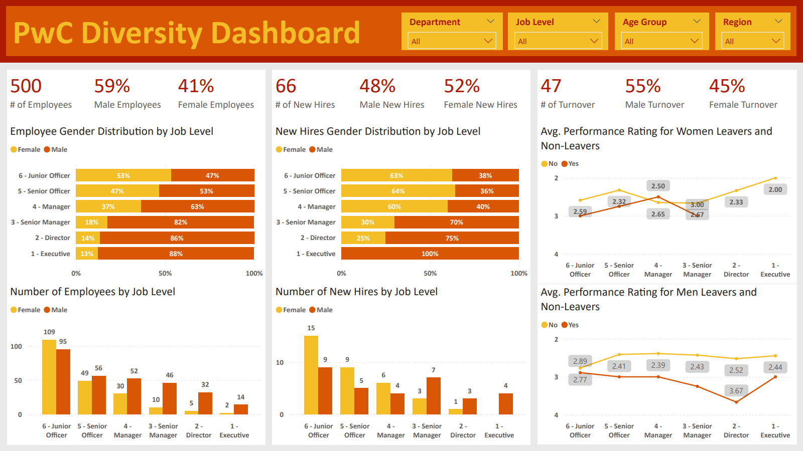
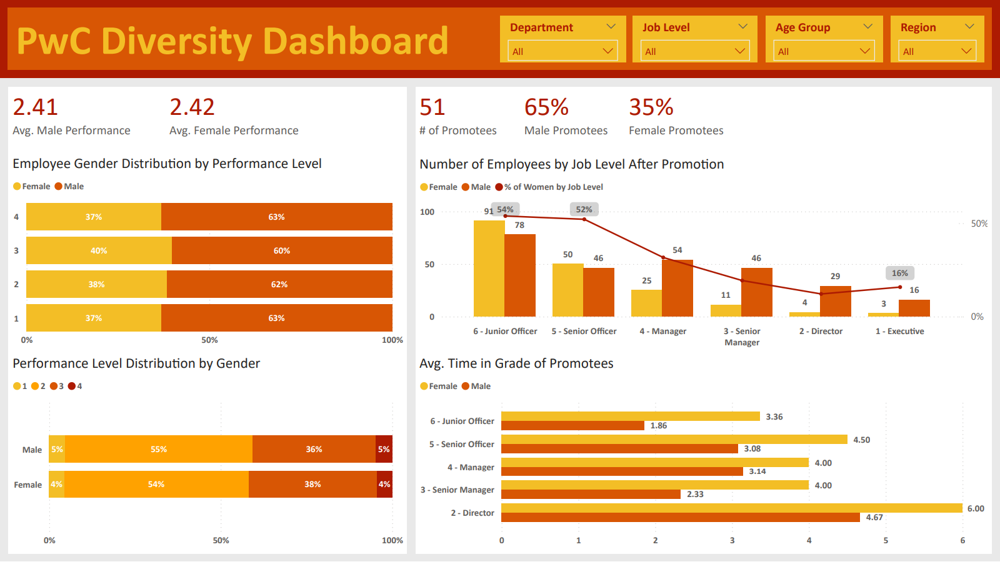
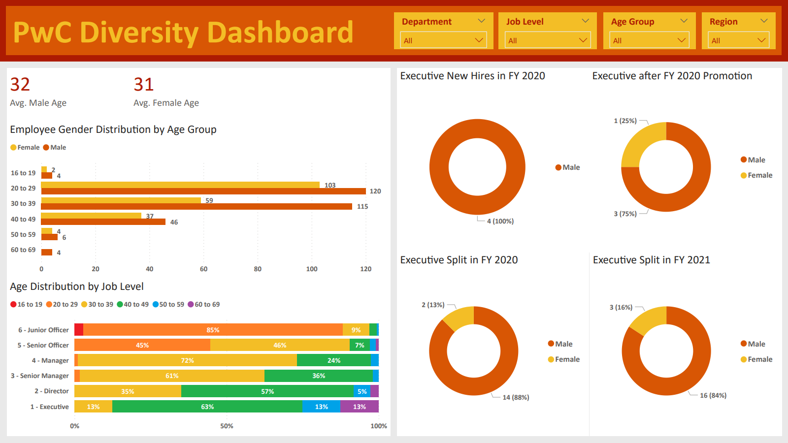

# Diversity Dashboard (PWC Power BI Project Part 3)

## Introduction
This dashboard is final part of a project from the [PwC Power BI micro-internship](https://www.theforage.com/simulations/pwc-ch/power-bi-cqxg) hosted by Forage. Pricewaterhouse Coopers International Limited (PwC) is a multinational professional services brand of firms that specializes in auditing and tax and business consulting.

In this task, the Human Resources department for PhoneNow, a fictional telecom company, has tasked me to construct a dashboard about gender balance. The purpose of creating the dashboard is to help identify issues that may cause gender inbalance at the executive level.

## Problem Statement
PhoneNow's Human Resources dapartment consider diversity and inclusions as business imperatives. The department is working hard to address the gender inbalance at the executive management level but they are seeing no progress in their efforts. The department requests a dashboard that highlights relevant Key Perfromance Indicators which can indicate portential solutions to solving the gender inbalance issue at the executive management level.

## Skills Demonstrated
* Power BI
* Data Visualization
* Dashboard Creation
* Defining KPIs
* Data Transfroming (Excel)
* Data Transforming (Power BI)
* Creating Measures (Power BI)
* Creating Calulated Columns (Power BI)

## Data Sourcing
This data was provided to me by the PwC Power BI micro-internship hosted by Forage. A copy of the data is included in this repository under the file name: 03 Diversity-Inclusion-Dataset.xlsx.

## Data Attributes
The data is PhoneNow's customer data. It includes data on customer demographics, payment data, and the type of services they subscribed to. The date ranges from Jan. 1 2021 to Mar. 31 2021.
* Employee ID - A unique number used to identify an employee.
* Gender - The gender of the employee (male or female).
* Job Level after FY20 promotions - The employee's job level after the fiscal year 2020 promotions.
* New hire FY20? - Whether or not the employee is a new hire in fiscal year 2020.
* FY20 Performance Rating - The performance rating for an employee during fiscal year 2020. The higher the rating, the better the performance.
* Promotion in FY21? - Whether or not the employee will be promoted in fiscal year 2021.
* In base group for Promotion FY21 - Whether or not the employee is considered for promotion in fiscal year 2021.
* Target hire balance - The desired gender balance ratio for an employee's position.
* FY20 leaver? - Has the employee left during fiscal year 2020?
* In base group for turnover FY20 - Whether or not the employee is considering leaving in fiscal year 2020.
* Department @01.07.2020 - The employee's department at Jan. 07 2020.
* Leaver FY - The fiscal year that the employee has left.
* Job Level after FY21 promotions - The employee's job level after the fiscal year 2021 promotions.
* Last Department in FY20 - The employee's department at the end of fiscal year 2020.
* FTE group - What percentage of a full day is the employee working?
* Time type - Whether the employee is a full time employee or part time employee.
* Department & JL group PRA status - The gender balance level for the employee's department and job level.
* Department & JL group for PRA - The epmloyee's department and job level.
* Job Level group PRA status - The gender balance level for the employee's job level.
* Job Level group for PRA - The employee's job level.
* Time in Job Level @01.07.2020 -  The number of years the employee has been at their job level.
* Job Level before FY20 promotions - The employee's job level before the fiscal year 2020 promotion.
* Promotion in FY20? - Whether the employee will be promoted in fiscal year 2020.
* FY19 Performance Rating - The employee's performance rating in fiscal year 2019. The higher the rating, the better the performance.
* Age group - The age group of the employee.
* Age @01.07.2020 -  The age of the employee on Jan. 07 2020.
* Nationality 1 - The employee's country of origin.
* Region group: nationality 1 - The employee's nationality, broader region than country.
* Broad region group: nationality 1 - The employee's nationality, broad region group.
* Last hire date - The date the employee was last hired.
* Years since last hire - How long ago the employee's last hire date was.
* Rand - Random numbers for calculations.

## Data Transformation
The data was transformed using the Power Query Editor from Power BI.
* To include relavant data into the dashboard, measures are created to calculate values from the data.
* These measuress are used to calculate the total number of new hires, employees who left, and employees promoted:
```
Number of New Hires = CALCULATE(
                                COUNT('Pharma Group AG'[Employee ID]),
                                'Pharma Group AG'[New hire FY20?] = "Y"
                               )

Number of Promotees = CALCULATE(
                                COUNT('Pharma Group AG'[Employee ID]),
                                'Pharma Group AG'[Promotion in FY21?] = "Yes"
                               )

Number of Turnover = CALCULATE(
                               COUNT('Pharma Group AG'[Employee ID]),
                               'Pharma Group AG'[FY20 leaver?] = "Yes"
                              )

# The COUNT() function is used to count the number of data points in a column.
# The CALCULATE() function is used to add a condition to an aggregate function such as COUNT().
```
* These measures are used to calculate the gender distribution percentage between all employees, new hires, employees who have left, and employees promoted.
```
% of Employees: Female = DIVIDE(
                                CALCULATE(
                                          COUNT('Pharma Group AG'[Employee ID]),
                                          'Pharma Group AG'[Gender] = "Female"
                                         ),
                                COUNT('Pharma Group AG'[Employee ID])
                                )

% of Employees: Male = DIVIDE(
                              CALCULATE(
                                        COUNT('Pharma Group AG'[Employee ID]),
                                        'Pharma Group AG'[Gender] = "Male"
                                       ),
                              COUNT('Pharma Group AG'[Employee ID])
                              )

% of Hires: Female = DIVIDE(
                            CALCULATE(
                                      COUNT('Pharma Group AG'[Employee ID]),
                                      'Pharma Group AG'[Gender] = "Female",
                                      'Pharma Group AG'[New hire FY20?] = "Y"
                                     ),
                            CALCULATE(
                                      COUNT('Pharma Group AG'[Employee ID]),
                                      'Pharma Group AG'[New hire FY20?] = "Y"
                                     )
                            )

% of Hires: Male = DIVIDE(
                          CALCULATE(
                                    COUNT('Pharma Group AG'[Employee ID]),
                                    'Pharma Group AG'[Gender] = "Male",
                                    'Pharma Group AG'[New hire FY20?] = "Y"
                                   ),
                          CALCULATE(
                                    COUNT('Pharma Group AG'[Employee ID]),
                                    'Pharma Group AG'[New hire FY20?] = "Y"
                                   )
                          )

% of Promotees: Female = DIVIDE(
                                CALCULATE(
                                          COUNT('Pharma Group AG'[Employee ID]),
                                          'Pharma Group AG'[Gender] = "Female",
                                          'Pharma Group AG'[Promotion in FY21?] = "Yes"
                                         ),
                                CALCULATE(
                                          COUNT('Pharma Group AG'[Employee ID]),
                                          'Pharma Group AG'[Promotion in FY21?] = "Yes"
                                         )
                               )

% of Promotees: Male = DIVIDE(
                              CALCULATE(
                                        COUNT('Pharma Group AG'[Employee ID]),
                                        'Pharma Group AG'[Gender] = "Male",
                                        'Pharma Group AG'[Promotion in FY21?] = "Yes"
                                       ),
                              CALCULATE(
                                        COUNT('Pharma Group AG'[Employee ID]),
                                        'Pharma Group AG'[Promotion in FY21?] = "Yes"
                                       )
                              )

% of Turnover: Female = DIVIDE(
                               CALCULATE(
                                         COUNT('Pharma Group AG'[Employee ID]),
                                         'Pharma Group AG'[Gender] = "Female",
                                         'Pharma Group AG'[FY20 leaver?] = "Yes"
                                        ),
                               CALCULATE(
                                         COUNT('Pharma Group AG'[Employee ID]),
                                         'Pharma Group AG'[FY20 leaver?] = "Yes"
                                        )
                               )

% of Turnover: Male = DIVIDE(
                             CALCULATE(
                                       COUNT('Pharma Group AG'[Employee ID]),
                                       'Pharma Group AG'[Gender] = "Male",
                                       'Pharma Group AG'[FY20 leaver?] = "Yes"
                                      ),
                             CALCULATE(
                                       COUNT('Pharma Group AG'[Employee ID]),
                                       'Pharma Group AG'[FY20 leaver?] = "Yes"
                                      )
                             )

# The DIVIDE() function is used to divide 2 numbers or the output of 2 functions.
# The first part of the DIVIDE() function represents the numerator and the second part represents the denominator.
```
* These measures are used to calculate the average age and performance rating for men and women.
```
Avg. Performance Rating: Female = CALCULATE(
                                            AVERAGE('Pharma Group AG'[FY20 Performance Rating]),
                                            'Pharma Group AG'[Gender] = "Female"
                                           )

Avg. Performance Rating: Male = CALCULATE(
                                          AVERAGE('Pharma Group AG'[FY20 Performance Rating]),
                                          'Pharma Group AG'[Gender] = "Male"
                                         )

Avg. Age: Female = CALCULATE(
                             AVERAGE('Pharma Group AG'[Age @01.07.2020]),
                             'Pharma Group AG'[Gender] = "Female"
                            )

Avg. Age: Male = CALCULATE(
                           AVERAGE('Pharma Group AG'[Age @01.07.2020]),
                           'Pharma Group AG'[Gender] = "Male"
                          )

# The AVERAGE() function is used to find the average value of a column.
```

## Data Analysis and Visuals
A copy of the below dashboards are included in this repository under the file name: James Weber PwC Diversity Dashboard.pbix.

The below images is a screenshot of the first page of the Diversity Dashboard.



The below images is a screenshot of the second page of the Diversity Dashboard.



The below images is a screenshot of the last page of the Diversity Dashboard.


* Male employees make up 59% of PhoneNow's workforce, female employees make up 41%. The gender balance within the executive level should resemble the gender balance of the whole company.
* Lower level positions like Junior Officer, Senior Officer, and Manager positions gain more female new hires than male new hires. There are no female new hires for Executive level positions. The lack of female new hires in higher level positions will affect future executive gender balance. Female employees have a better chance of being promoted into Executive level positions when they are hired into higher level positions like Senior Manager or Director.
* There are more male employees leaving PhoneNow than female employees. There may be more male employees leaving because there are more male employees working in PhoneNow. Both male and female leavers have lower average performance scores than male and female employees who are staying. Only female employees in Manager level positions have a lower average score than female leavers. Further investigation may be needed to explain the discrepancy.
* Both male and female employees have similar average performance score, with male employees having a slightly higher score. Males make up a higher percentage for all scores because there are more male employees than female employees.
* Female employees in lower level positions have a better chance at promotion compared to male employees. Female promotees in all job levels have a longer average time in grade than male promotees.
* Male and female employees have similar average age. Employees who are executive level are primarily in the 40 to 49 age range.
* There are no female executive new hires. There is only 1 female employee who was promoted to executive level compared to 3 male employees. From FY20 to FY21, the percentage of female executive rose 3%.

## Conclusions and Recommendations
* Male and female employees have similar performance ratings and age distribution. For both genders, employees who leave PhoneNow tend to have lower performance ratings.
* The biggest factors that affect the imbalance between male and female employees in the executive level seems to be:
  * There are less female new hires in higher level positions than male new hires.
  * Male employees are more often promoted than female employees at higher job levels.
  * Female employees who are promoted spend a longer time in grade on average than male employees.
* To improve the number of female new hires in higher positions, we need to determine why women are less likely to apply to higher positions. We could encourage current female employees to apply to higher level positions and hire internally. We can also advertise higher level positions for potential female employees on our website.
* To improve on female employee promotions, we need to determine why female employees spend longer time grade before getting promoted. If the issue is due to female employee performance level at higher job levels, we could offer mentorship to female employees to improve their performance level at their current position.
