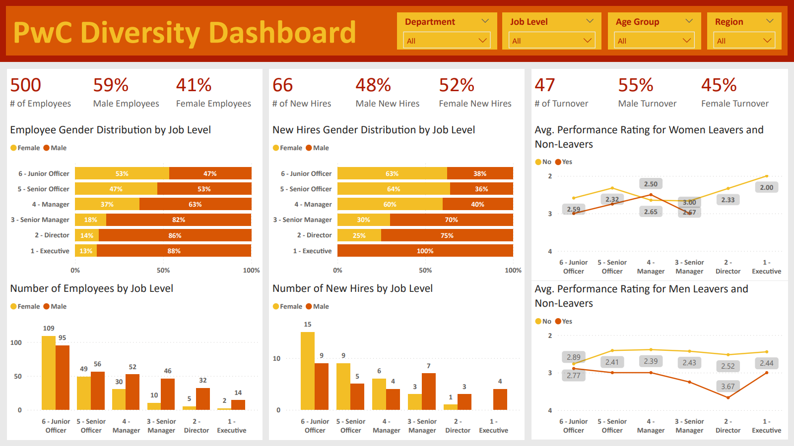
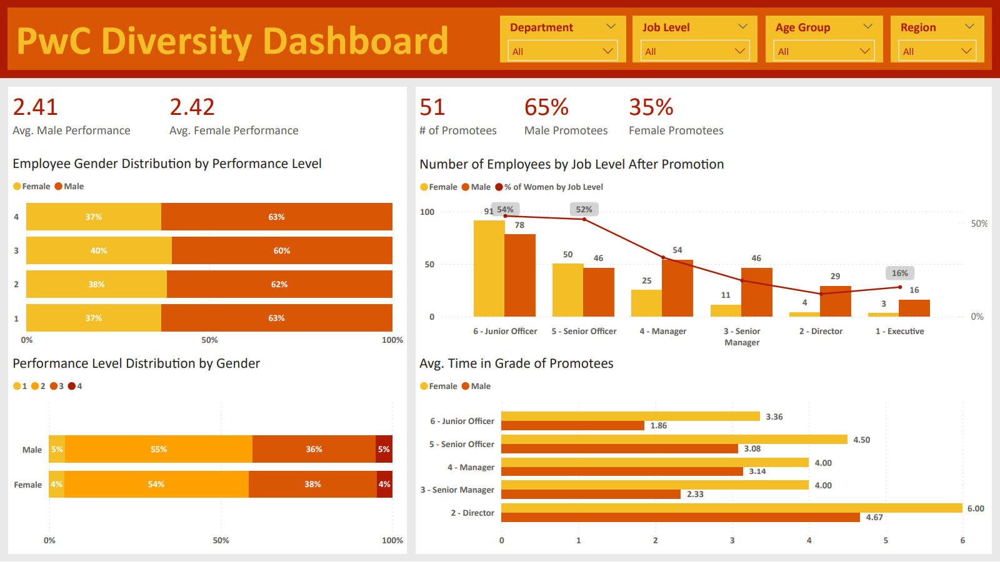
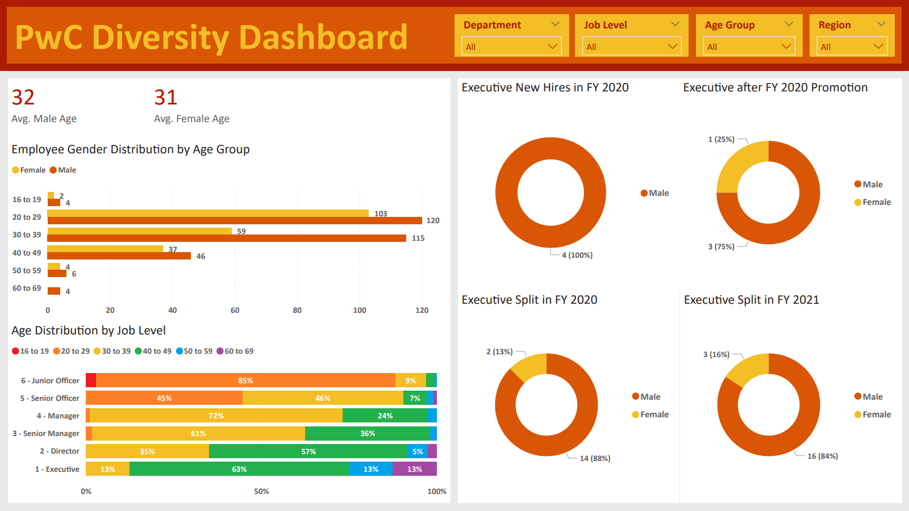

# Diversity Dashboard (PWC Power BI Project Part 3)

## Introduction
This dashboard is final part of a project from the [PwC Power BI micro-internship](https://www.theforage.com/simulations/pwc-ch/power-bi-cqxg) hosted by Forage. Pricewaterhouse Coopers International Limited (PwC) is a multinational professional services brand of firms that specializes in auditing and tax and business consulting.

In this task, the Human Resources department for PhoneNow, a fictional telecom company, has tasked me to construct a dashboard about gender balance. The purpose of creating the dashboard is to help identify issues that may cause gender imbalance at the executive level.

## Problem Statement
PhoneNow's Human Resources dapartment consider diversity and inclusions as business imperatives. The department is working hard to address the gender inbalance at the executive management level but they are seeing no progress in their efforts. The department requests a dashboard that highlights relevant Key Performance Indicators which can indicate potential solutions to solving the gender imbalance issue at the executive management level.

## Skills Demonstrated
* Power BI
* Data Visualization
* Dashboard Creation
* Defining KPIs
* Data Transfroming (Excel)
* Data Transforming (Power BI)
* Creating Measures (Power BI)
* Creating Calulated Columns (Power BI)

## Data Sourcing
This data was provided to me by the PwC Power BI micro-internship hosted by Forage. A copy of the data is included in this repository under the file name: 03 Diversity-Inclusion-Dataset.xlsx.

## Data Attributes
The data is PhoneNow's customer data. It includes data on customer demographics, payment data, and the type of services they subscribed to. The date ranges from Jan. 1 2021 to Mar. 31 2021.
* Employee ID - A unique number used to identify an employee.
* Gender - The gender of the employee (male or female).
* Job Level after FY20 promotions - The employee's job level after the fiscal year 2020 promotions.
* New hire FY20? - Whether or not the employee is a new hire in fiscal year 2020.
* FY20 Performance Rating - The performance rating for an employee during fiscal year 2020. The higher the rating, the better the performance.
* Promotion in FY21? - Whether or not the employee will be promoted in fiscal year 2021.
* In base group for Promotion FY21 - Whether or not the employee is considered for promotion in fiscal year 2021.
* Target hire balance - The desired gender balance ratio for an employee's position.
* FY20 leaver? - Has the employee left during fiscal year 2020?
* In base group for turnover FY20 - Whether or not the employee is considering leaving in fiscal year 2020.
* Department @01.07.2020 - The employee's department at Jan. 07 2020.
* Leaver FY - The fiscal year that the employee has left.
* Job Level after FY21 promotions - The employee's job level after the fiscal year 2021 promotions.
* Last Department in FY20 - The employee's department at the end of fiscal year 2020.
* FTE group - What percentage of a full day is the employee working?
* Time type - Whether the employee is a full time employee or part time employee.
* Department & JL group PRA status - The gender balance level for the employee's department and job level.
* Department & JL group for PRA - The epmloyee's department and job level.
* Job Level group PRA status - The gender balance level for the employee's job level.
* Job Level group for PRA - The employee's job level.
* Time in Job Level @01.07.2020 -  The number of years the employee has been at their job level.
* Job Level before FY20 promotions - The employee's job level before the fiscal year 2020 promotion.
* Promotion in FY20? - Whether the employee will be promoted in fiscal year 2020.
* FY19 Performance Rating - The employee's performance rating in fiscal year 2019. The higher the rating, the better the performance.
* Age group - The age group of the employee.
* Age @01.07.2020 -  The age of the employee on Jan. 07 2020.
* Nationality 1 - The employee's country of origin.
* Region group: nationality 1 - The employee's nationality, broader region than country.
* Broad region group: nationality 1 - The employee's nationality, broad region group.
* Last hire date - The date the employee was last hired.
* Years since last hire - How long ago the employee's last hire date was.
* Rand - Random numbers for calculations.

## Data Transformation
The data was transformed using the Power Query Editor from Power BI.
* To include relavant data into the dashboard, measures are created to calculate values from the data.
* These measuress are used to calculate the total number of new hires, employees who left, and employees promoted:
```
Number of New Hires = CALCULATE(
                                COUNT('Pharma Group AG'[Employee ID]),
                                'Pharma Group AG'[New hire FY20?] = "Y"
                               )

Number of Promotees = CALCULATE(
                                COUNT('Pharma Group AG'[Employee ID]),
                                'Pharma Group AG'[Promotion in FY21?] = "Yes"
                               )

Number of Turnover = CALCULATE(
                               COUNT('Pharma Group AG'[Employee ID]),
                               'Pharma Group AG'[FY20 leaver?] = "Yes"
                              )

# The COUNT() function is used to count the number of data points in a column.
# The CALCULATE() function is used to add a condition to an aggregate function such as COUNT().
```
* These measures are used to calculate the gender distribution percentage between all employees, new hires, employees who have left, and employees promoted.
```
% of Employees: Female = DIVIDE(
                                CALCULATE(
                                          COUNT('Pharma Group AG'[Employee ID]),
                                          'Pharma Group AG'[Gender] = "Female"
                                         ),
                                COUNT('Pharma Group AG'[Employee ID])
                                )

% of Employees: Male = DIVIDE(
                              CALCULATE(
                                        COUNT('Pharma Group AG'[Employee ID]),
                                        'Pharma Group AG'[Gender] = "Male"
                                       ),
                              COUNT('Pharma Group AG'[Employee ID])
                              )

% of Hires: Female = DIVIDE(
                            CALCULATE(
                                      COUNT('Pharma Group AG'[Employee ID]),
                                      'Pharma Group AG'[Gender] = "Female",
                                      'Pharma Group AG'[New hire FY20?] = "Y"
                                     ),
                            CALCULATE(
                                      COUNT('Pharma Group AG'[Employee ID]),
                                      'Pharma Group AG'[New hire FY20?] = "Y"
                                     )
                            )

% of Hires: Male = DIVIDE(
                          CALCULATE(
                                    COUNT('Pharma Group AG'[Employee ID]),
                                    'Pharma Group AG'[Gender] = "Male",
                                    'Pharma Group AG'[New hire FY20?] = "Y"
                                   ),
                          CALCULATE(
                                    COUNT('Pharma Group AG'[Employee ID]),
                                    'Pharma Group AG'[New hire FY20?] = "Y"
                                   )
                          )

% of Promotees: Female = DIVIDE(
                                CALCULATE(
                                          COUNT('Pharma Group AG'[Employee ID]),
                                          'Pharma Group AG'[Gender] = "Female",
                                          'Pharma Group AG'[Promotion in FY21?] = "Yes"
                                         ),
                                CALCULATE(
                                          COUNT('Pharma Group AG'[Employee ID]),
                                          'Pharma Group AG'[Promotion in FY21?] = "Yes"
                                         )
                               )

% of Promotees: Male = DIVIDE(
                              CALCULATE(
                                        COUNT('Pharma Group AG'[Employee ID]),
                                        'Pharma Group AG'[Gender] = "Male",
                                        'Pharma Group AG'[Promotion in FY21?] = "Yes"
                                       ),
                              CALCULATE(
                                        COUNT('Pharma Group AG'[Employee ID]),
                                        'Pharma Group AG'[Promotion in FY21?] = "Yes"
                                       )
                              )

% of Turnover: Female = DIVIDE(
                               CALCULATE(
                                         COUNT('Pharma Group AG'[Employee ID]),
                                         'Pharma Group AG'[Gender] = "Female",
                                         'Pharma Group AG'[FY20 leaver?] = "Yes"
                                        ),
                               CALCULATE(
                                         COUNT('Pharma Group AG'[Employee ID]),
                                         'Pharma Group AG'[FY20 leaver?] = "Yes"
                                        )
                               )

% of Turnover: Male = DIVIDE(
                             CALCULATE(
                                       COUNT('Pharma Group AG'[Employee ID]),
                                       'Pharma Group AG'[Gender] = "Male",
                                       'Pharma Group AG'[FY20 leaver?] = "Yes"
                                      ),
                             CALCULATE(
                                       COUNT('Pharma Group AG'[Employee ID]),
                                       'Pharma Group AG'[FY20 leaver?] = "Yes"
                                      )
                             )

# The DIVIDE() function is used to divide 2 numbers or the output of 2 functions.
# The first part of the DIVIDE() function represents the numerator and the second part represents the denominator.
```
* These measures are used to calculate the average age and performance rating for men and women.
```
Avg. Performance Rating: Female = CALCULATE(
                                            AVERAGE('Pharma Group AG'[FY20 Performance Rating]),
                                            'Pharma Group AG'[Gender] = "Female"
                                           )

Avg. Performance Rating: Male = CALCULATE(
                                          AVERAGE('Pharma Group AG'[FY20 Performance Rating]),
                                          'Pharma Group AG'[Gender] = "Male"
                                         )

Avg. Age: Female = CALCULATE(
                             AVERAGE('Pharma Group AG'[Age @01.07.2020]),
                             'Pharma Group AG'[Gender] = "Female"
                            )

Avg. Age: Male = CALCULATE(
                           AVERAGE('Pharma Group AG'[Age @01.07.2020]),
                           'Pharma Group AG'[Gender] = "Male"
                          )

# The AVERAGE() function is used to find the average value of a column.
```

## Data Analysis and Visuals
A copy of the below dashboards are included in this repository under the file name: James Weber PwC Diversity Dashboard.pbix.

The below images is a screenshot of the first page of the Diversity Dashboard.



The below images is a screenshot of the second page of the Diversity Dashboard.



The below images is a screenshot of the last page of the Diversity Dashboard.


* PhoneNow is experiencing lack of women at higher levels.  PhoneNow has no issues recruiting female talent. Women outnumber men at the junior officer level (53% female, 47% male). However, at the senior officer level, men start outnumbering women (47% female, 53% male), and at manager level, there is a large gap beween the number of men and women (37% female, 63% male). Every level senior results in less women. This indicates that the root problem is retention and upward mobility, not hiring.
* PhoneNow is hiring women for lower-to-middle management roles. New hires for junior and senior officer, and manager roles are 60% to 64% female. However, new hires for higher positions like senior managers, directors, and executives are 30%, 25%, and 0% female respectively. Because PhoneNow is hiring 3x more male Senior Managers and Directors than females, this strategy is reinforcing, rather than fixing, the executive gender gap.
* At the junior and senior officer levels, both male and female leavers have an average performance score lower than employees who stayed. This pattern continues at higher level for males, but for females,  leavers have a higher average performance rating (2.65) than the women who stay (2.50). PhoneNow is failing to retain its best female managers. At the director and executive levels, there are no performance rating for female employees who stayed. This suggests that the few women who reached the top are actively leaving, leaving zero or near-zero baseline female leadership.
* The overall performance for males and females (2.41 and 2.42 respectively) indicates that men and women performance is virtually identical. There is no systemic performance difference between genders. The internal spread across performance levels is nearly identical for both genders. Men make up 60% to 63% of the recipients, while women make up 37% to 40%. This is because there are more men in the company, so there are more men at every performance level. Performance cannot be used to justify the lack of women in leadership.
* Promotion data reveals that there is a massive time-in-grade penalty for women and a bottleneck that restricts female advancement to upper management. Despite identical performance across the company, women face much slower career progression than men. Female Junior Officers take 3.36 years to get promoted compared to just 1.86 years for men. To reach Senior Manager or Director, women must stay in their roles for 4 to 6 years, while men bypass them in 2.3 to 4.67 years.
* Women who work at PhoneNow suffer from early career drop off, where women in their 30s exit the talent pool. In the 20–29 age bracket, the gender gap is small (120 men to 103 women). However, in the 30–39 bracket, the female population collapses by nearly half (to 59), while the male population stays almost entirely stable (115).  Across the company, Manager and Senior Manager roles are heavily dominated by the 30–39 age group. ecause women are disappearing from the company in their 30s, there are very few women available to fill these mid-level management roles. In the 40–49 age bracket, female representation stabilizes slightly (46 men to 37 women). This indicates that the gender imbalance is driven sharply by events occurring in employees' 30s.

## Conclusions and Recommendations
* The biggest contributors for the gender imbalance at the executive level are promotion delay and retention issues affecting women in their 30s.
* Base promotion readiness strictly on objective performance and skill milestones rather than length of service. Configure HR systems to automatically flag any employee who achieves a Level 3 or 4 performance rating for promotion review.
* Offer robust remote work options and flexible hours to prevent women from exiting the workforce due to work-life or childcare conflicts.
* Create specific pathways to easily reintegrate high-performing employees who take parental leave, ensuring their career trajectory and promotion timelines are legally protected and structurally insulated.
* Require external recruitment firms to present shortlists that are at least 50% qualified women for all manager, director, and executive openings.
* Remove names, genders, and graduation years from initial applicant profiles for senior roles to eliminate unconscious bias during the recruitment phase.
* Include high-performing female managers and senior managers in high-visibility projects, board presentations, and strategic decision-making groups to prepare them for director vacancies.
